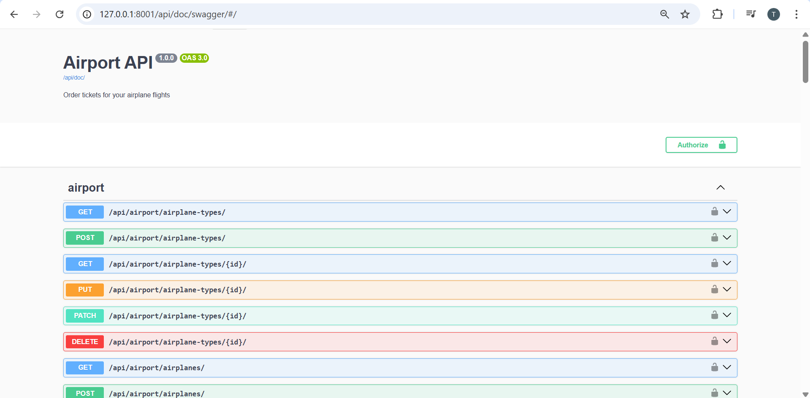
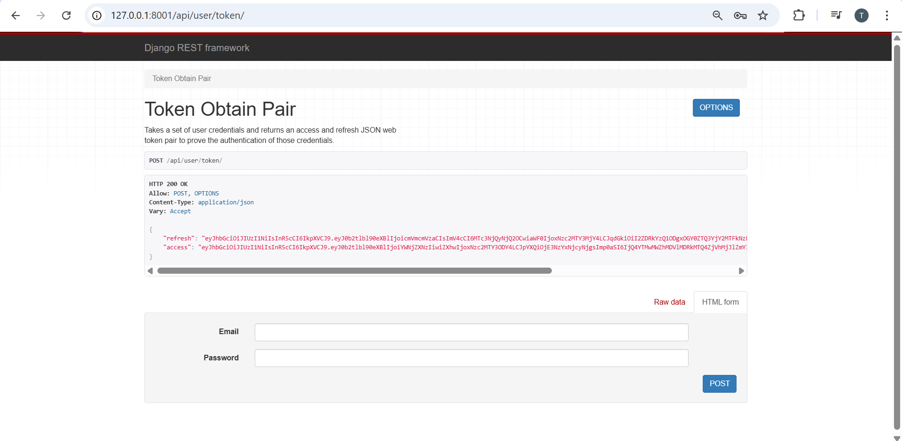
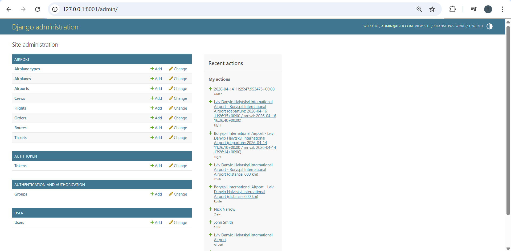
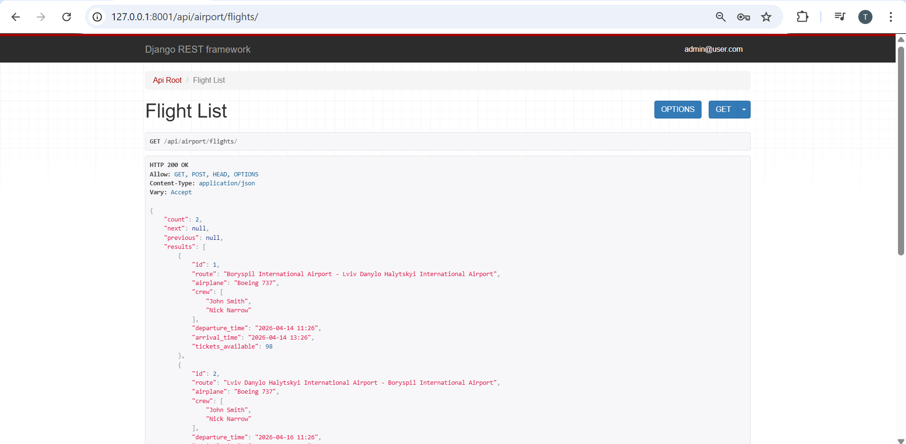
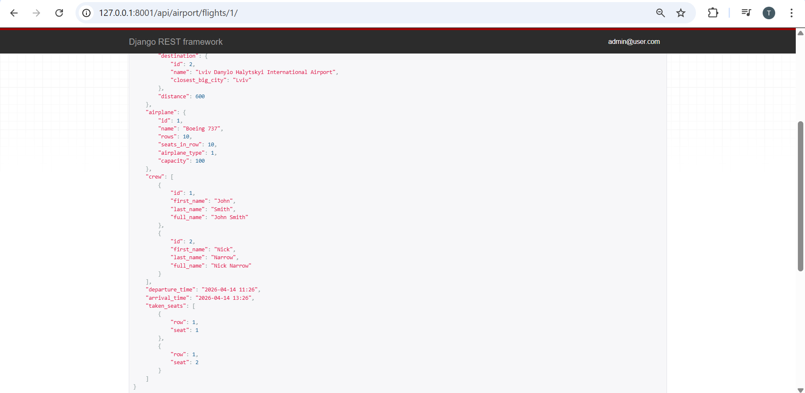
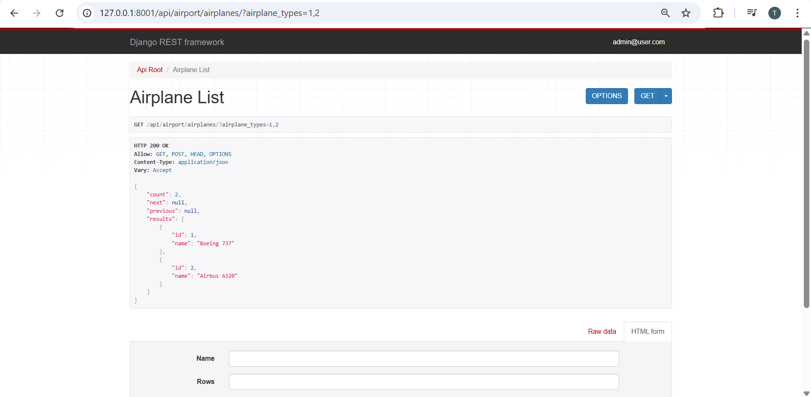
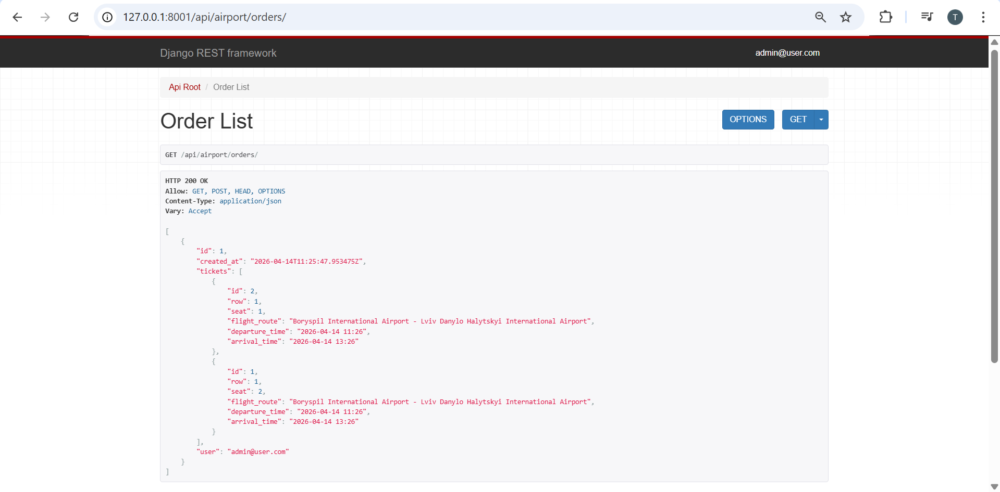
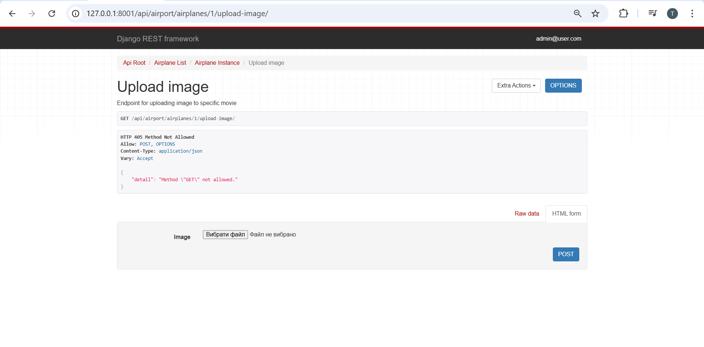
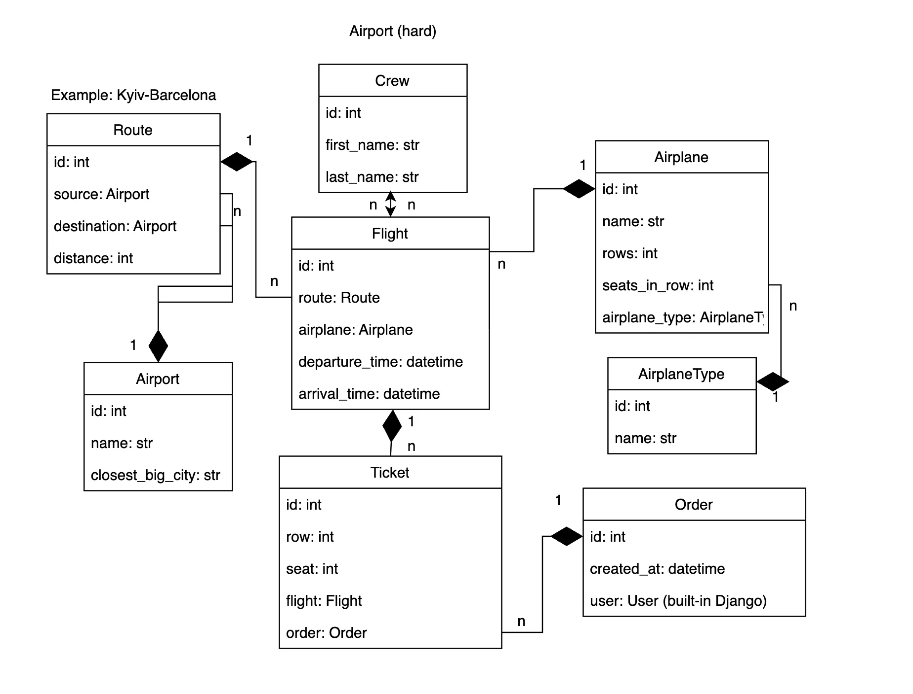

# Airport API

API service for airport management written on DRF

## Installing using GitHub

```bash
git clone https://github.com/tarasmosiichuk01-ship-it/airport-api.git
cd airport-api
python -m venv venv
source venv/bin/activate  # for MacOS/Linux
venv\Scripts\activate     # for Windows
pip install -r requirements.txt
set POSTGRES_HOST=<your db hostname>
set POSTGRES_DB=<your db name>
set POSTGRES_USER=<your db username>
set POSTGRES_PASSWORD=<your db user password>
set SECRET_KEY=<your secret key>
python manage.py migrate
python manage.py runserver
```

## Run with Docker

Docker should be installed

```bash
docker-compose build
docker-compose up
```

## Getting access

- create user via /api/user/register/
- get access token via /api/user/token/

## Features

- JWT authenticated
- Admin panel /admin/
- Documentation is located at /api/doc/swagger/
- Managing orders and tickets
- Managing airports, routes and flights
- Managing airplanes and airplane types
- Managing crew members
- Filtering airplanes by type and name
- Filtering flights by route and date
- Filtering orders by date
- Image upload for airplanes
- Role-based access control (User/Admin)

## 🧪 Running Tests

You can run tests using local environment or Docker:

**Local:**
```shell
python manage.py test
```

## Page images

### 🔐 Authentication & Documentation

| Swagger | JWT Authentication | Admin Panel |
| :---: | :---: | :---: |
|  |  |  |

### 🎭 Content & Booking

| Flights | Flight Detail | Airplane Filtering | Reservations |
| :---: | :---: | :---: | :---: |
|  |  |  |  |

### 📁 Media & Schema

| Image Upload | Database Schema |
| :---: | :---: |
|  |  |
